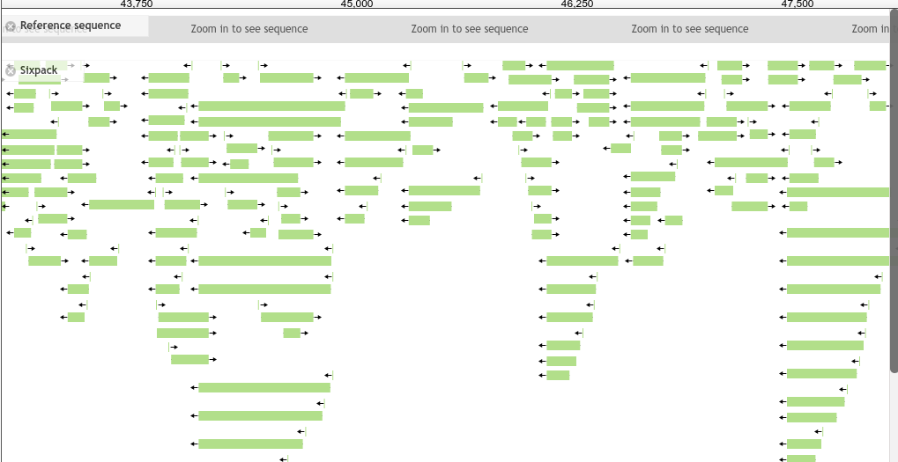

# ThemeComponent-DisableGrid

A JBrowse 'Theme Component' which disables the grid



# Usage

Add the following to your `trackList.json`. If you have an existing plugins section, you should add the plugin to that section.

```json
"plugins": {
	{
		"name": "ThemeComponent-DisableGrid",
		"location" : "https://cdn.rawgit.com/jbrowse-themes/ThemeComponent-DisableGrid/6bf3ef872dcd98d42d803f57f2dda010a8eabf3c"
	}
}
```

# LICENSE

GPL-3.0
